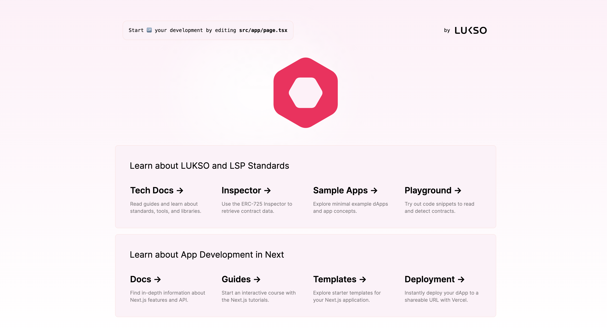

# 🏗️ LUKSO dApp Boilerplate

This repository is a TypeScript/Next.js based open-source framework to build LUKSO dApps with ease.

Demo URL: <https://boilerplate.lukso.tech/>

More information is available on our 👉 [technical documentation](https://docs.lukso.tech/learn/introduction).



## Features

- Reusable components for Universal Profiles, Assets, and Vaults
- Shared contexts for Profiles, Networks, and the Extension
- Network, interface, and metadata detection
- Multiple Providers: [Web3 Onboard](https://onboard.blocknative.com/docs/overview/introduction), [Wallet Connect](https://docs.walletconnect.com/web3modal/about), or plain injection
- Built-in [`ethers.js`](https://docs.ethers.org/), [`erc725.js`](https://docs.lukso.tech/tools/erc725js/getting-started), [`lsp-smart-contracts`](https://docs.lukso.tech/tools/lsp-smart-contracts/getting-started)
- Uses `Tailwind`, `Prettier`, `TypeScript`

> **INFO**: You can switch between a regular provider and [Web3-Onboard](https://onboard.blocknative.com/) by setting the `useOnboard` variable within the [EthereumContext](/src/contexts/EthereumContext.tsx).

## Development

Clone the repository:

```bash
git clone git@github.com:lukso-network/tools-dapp-boilerplate.git
```

Install all packages and libraries:

```bash
npm install
```

Setup local environment variables:

> If you use Wallet Connect, you will have to import a Project ID. You can simply copy the example environment file and input the parameter.

```bash
cp .env.local.example .env.local
```

Run the development server:

```bash
npm run dev
```

## Tools

- [`Next.js`](https://nextjs.org/): React Framework
- [`@lukso/lsp-smart-contracts`](https://www.npmjs.com/package/@lukso/lsp-smart-contracts): Schemas and Interfaces for LSPs
- [`@web3-onboard/core`](https://www.npmjs.com/package/@web3-onboard/core): Connecting with various Browser Extensions
- [`@erc725/erc725.js`](https://www.npmjs.com/package/@erc725/erc725.js): ERC725 Smart Contract Interactions
- [`ethers`](https://www.npmjs.com/package/ethers): Ethereum Library for Blockchain Interactions

## Resources

- [LUKSO Documentation](https://docs.lukso.tech/)
- [Next.js Documentation](https://nextjs.org/docs)

### Community Content

- [Speedrun the lukso-network/tools-dapp-boilerplate nextjs starter - YouTube](https://www.youtube.com/watch?v=OxJi7O7ts0Q) by tantodefi
